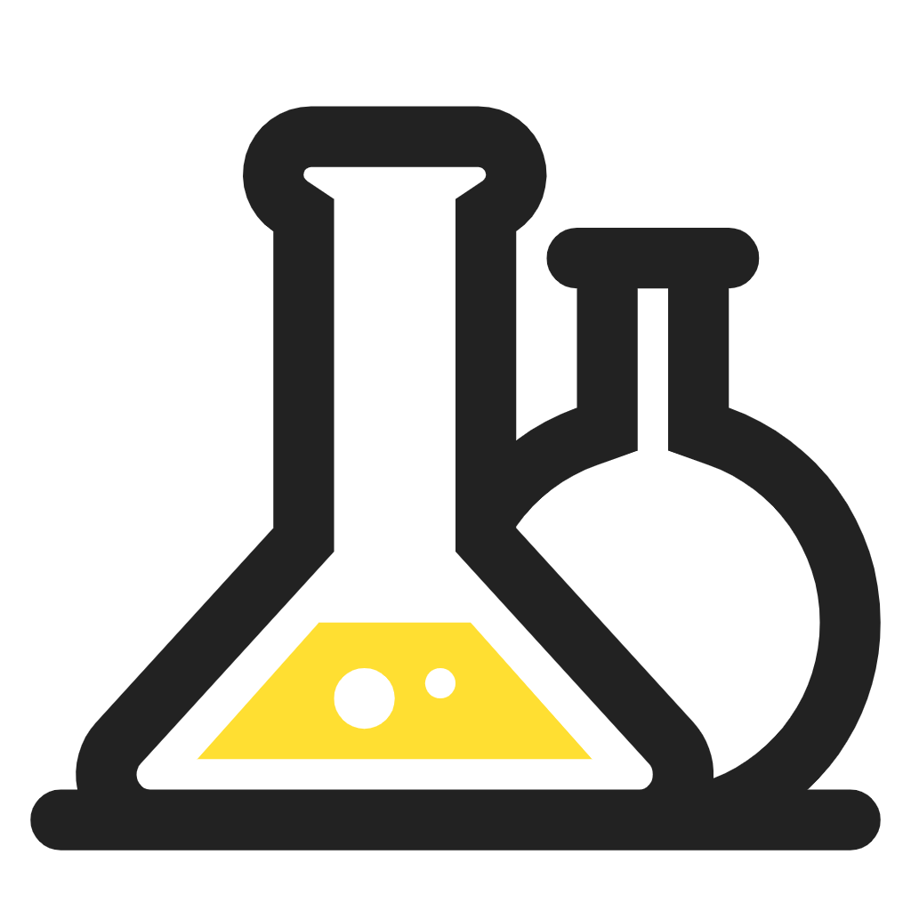

# 实验室预约系统 - 前端（管理端）

项目组项目：实验室预约系统 - 管理端

<!-- PROJECT SHIELDS -->
[![Contributors][contributors-shield]][contributors-url]
[![Forks][forks-shield]][forks-url]
[![Stargazers][stars-shield]][stars-url]
[![MIT License][license-shield]][license-url]
<!-- PROJECT LOGO -->
<br />

<p align="center">
  <a href="https://github.com/wmh1024/LaboratoryAdmin-frontend">
    
  </a>

  <h3 align="center">实验室预约系统 - 管理端</h3>
  <p align="center">
    一个基于 Vue3 + ElementUI plus 的管理系统！
    <br />

</p>

## 上手指南

克隆此项目

```sh
git clone https://github.com/wmh1024/LaboratoryAdmin-frontend.git
```

安装依赖

```sh
yarn
```

开发运行

```sh
yarn run dev
```

生产打包

```sh
yarn run build
```

## 使用到的框架

- Vue3
- Element UI Plus

## 如何参与开源项目

贡献使开源社区成为一个学习、激励和创造的绝佳场所。你所作的任何贡献都是**非常感谢**的。


1. Fork the Project
2. Create your Feature Branch (`git checkout -b feature/AmazingFeature`)
3. Commit your Changes (`git commit -m 'Add some AmazingFeature'`)
4. Push to the Branch (`git push origin feature/AmazingFeature`)
5. Open a Pull Request

## 版本控制

该项目使用Git进行版本管理。您可以在repository参看当前可用版本。

## 作者

[wmh](https://wmhwiki.cn)

 *您也可以在贡献者名单中参看所有参与该项目的开发者。*

## 版权说明

该项目签署了MIT 授权许可，详情请参阅 [LICENSE.txt](https://github.com/wmh1024/LaboratoryAdmin-frontend/blob/main/LICENSE.txt)

<!-- links -->
[your-project-path]:wmh1024/LaboratoryAdmin-frontend
[contributors-shield]: https://img.shields.io/github/contributors/wmh1024/LaboratoryAdmin-frontend.svg?style=flat-square
[contributors-url]: https://github.com/wmh1024/LaboratoryAdmin-frontend/graphs/contributors
[forks-shield]: https://img.shields.io/github/forks/wmh1024/LaboratoryAdmin-frontend.svg?style=flat-square
[forks-url]: https://github.com/wmh1024/LaboratoryAdmin-frontend/network/members
[stars-shield]: https://img.shields.io/github/stars/wmh1024/LaboratoryAdmin-frontend.svg?style=flat-square
[stars-url]: https://github.com/wmh1024/LaboratoryAdmin-frontend/stargazers
[issues-shield]: https://img.shields.io/github/issues/wmh1024/LaboratoryAdmin-frontend.svg?style=flat-square
[issues-url]: https://img.shields.io/github/issues/wmh1024/LaboratoryAdmin-frontend.svg
[license-shield]: https://img.shields.io/github/license/wmh1024/LaboratoryAdmin-frontend.svg?style=flat-square
[license-url]: https://github.com/wmh1024/LaboratoryAdmin-frontend/blob/master/LICENSE.txt
[linkedin-shield]: https://img.shields.io/badge/-LinkedIn-black.svg?style=flat-square&logo=linkedin&colorB=555
[linkedin-url]: https://linkedin.com/in/shaojintian
